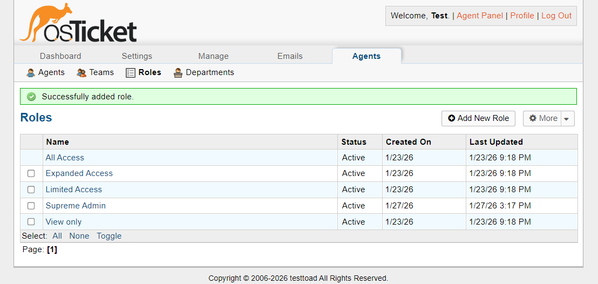
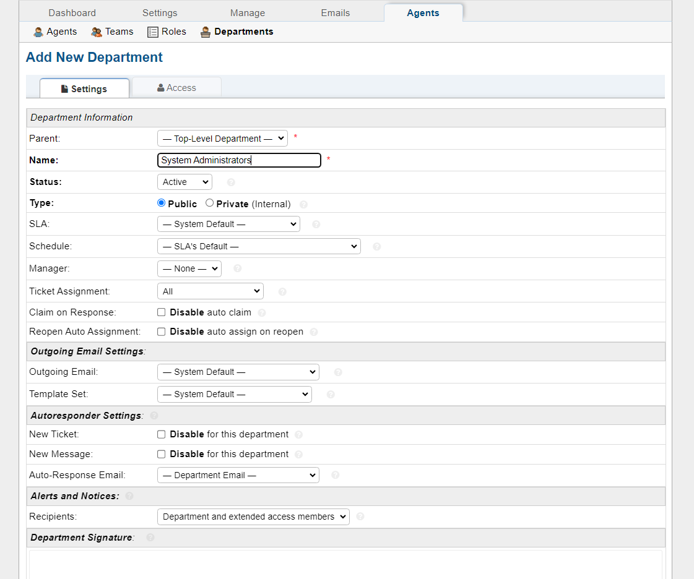
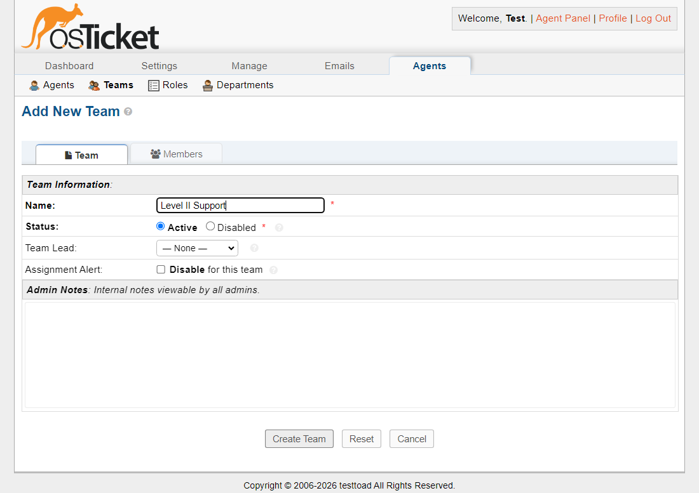
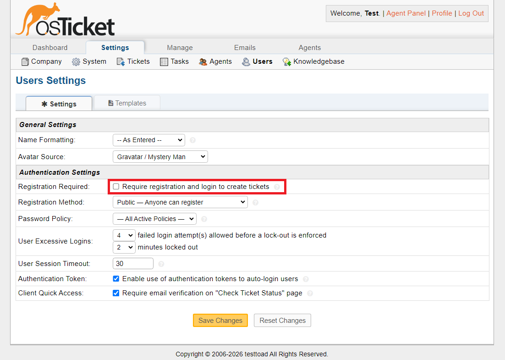
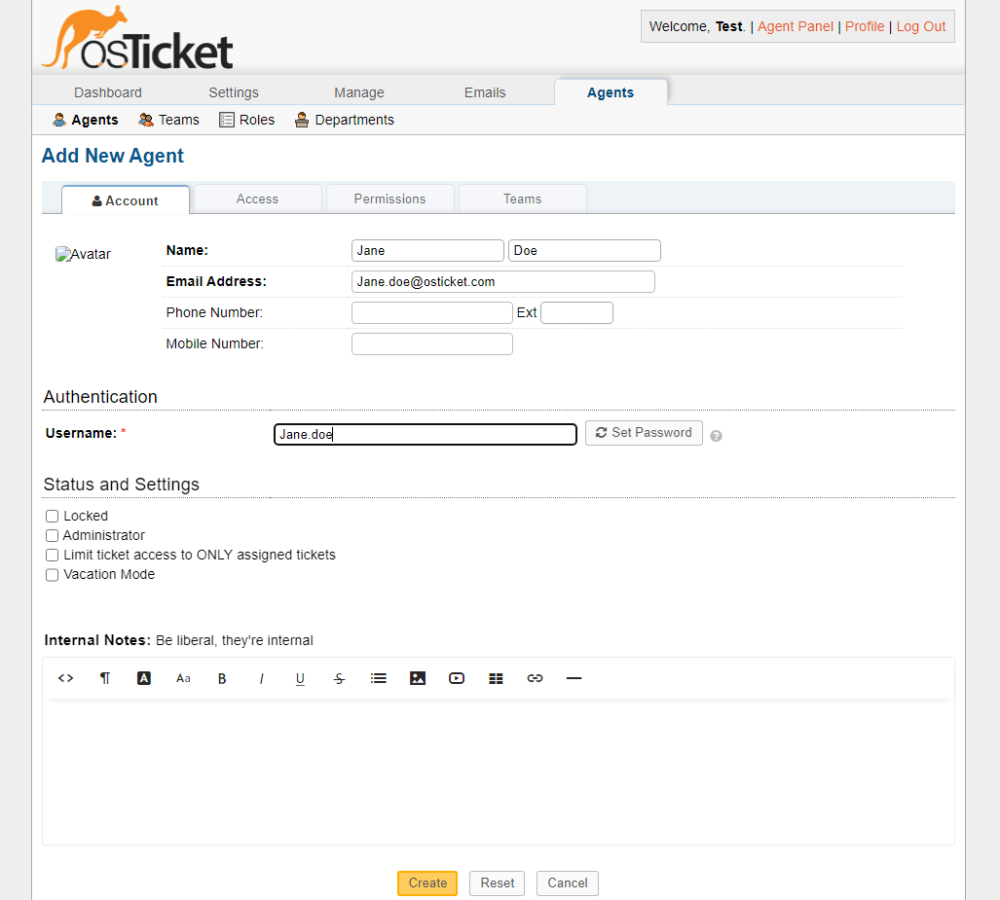
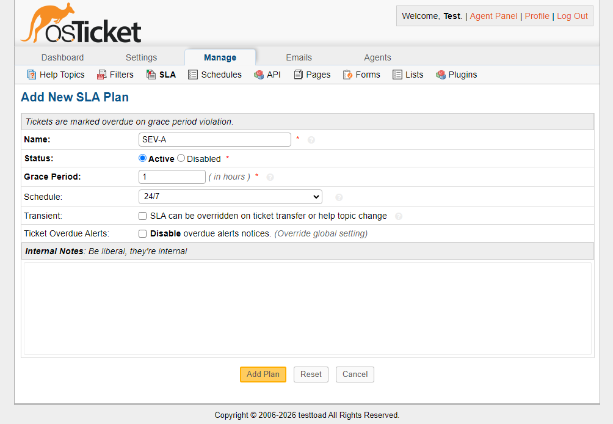
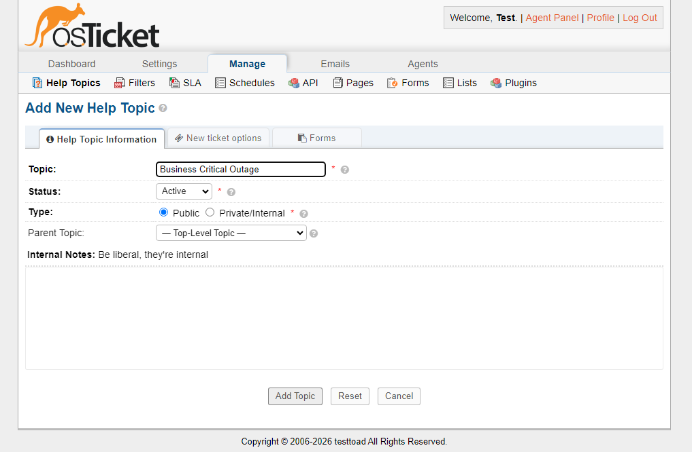

  

<h1 align="center">osTicket - Post-Installation Configuration</h1>

This tutorial demonstrates the post-installation setup and configuration of the osTicket help desk system.

---

## Introduction

Great! We have successfully installed osTicket. Now, we will proceed with system administration and post-installation configuration.

## 1. Configuring Roles

Roles define an agent's permissions within the help desk.
**Navigate to:** `Admin Panel → Agents → Roles`

1. Click **"Add New Role"**.
2. Enter the role name (e.g., "Supreme Admin").
3. Modify specific permissions as needed. For a "Supreme Admin," grant all permissions.
4. Click **Save Changes**.

> **Note:** Roles determine agent permissions, so not all agents will have unlimited access.

---

## 2. Creating Departments

Departments organize agents by function.  
**Navigate to:** `Admin Panel → Agents → Departments`

1. Click **"Add New Department"**.
2. Name the department (e.g., "System Administrators").
3. Configure additional settings such as SLAs, managers, and email options.
4. Click **Create**.

---

## 3. Setting Up Teams

Teams allow you to group agents from different departments for specific tasks.
**Navigate to:** `Admin Panel → Agents → Teams`

1. Click **"Add New Team"**.
2. Name the team (e.g., "Level II Support").
3. Assign agents from various departments.
4. Click **Create**.

---

## 4. Enabling Ticket Creation

Allow users to create tickets via the user settings.  
**Navigate to:** `Admin Panel → Settings → User Settings`

1. Ensure **"Registration Required"** is unchecked if you want anyone to create tickets.
2. Adjust other settings as needed.
3. Save changes.

---

## 5. Creating Agents (Help Desk Staff)

Agents are staff members who resolve tickets.  
**Navigate to:** `Admin Panel → Agents → Add New`

1. Fill in agent details (name, email, username, password).
2. Assign a primary department and role.
3. Set permissions, access, and team assignments.
4. Click **Create**.

---

## 6. Creating Users (Customers)

Users are customers who submit tickets.  
**Navigate to:** `Agent Panel → Users → User Directory → Add New`

1. Enter the user's email and name.
2. Add any additional contact information.
3. Click **Add User**.

---

## 7. Configuring SLA Plans

SLA (Service Level Agreement) plans define expected resolution times.  
**Navigate to:** `Admin Panel → Manage → SLA Plans`

1. Click **"Add New SLA Plan"**.
2. Name the plan (e.g., "SEV-A").
3. Set the schedule (e.g., 24/7) and grace period (e.g., 1 hour).
4. Click **Add Plan**.

---

## 8. Setting Up Help Topics

Help topics allow users to categorize their tickets.
**Navigate to:** `Admin Panel → Manage → Help Topics`

1. Click **"Add New Help Topic"**.
2. Name the topic (e.g., "Business Critical Outage").
3. Provide a description.
4. Click **Add Topic**.

